```{=html}

<style>
  /* 0. On passe le fond global en bleu nuit et le texte en blanc pour tout le document */
  body {
    background-color: #0f172a !important;
    color: #ffffff !important; /* CORRECTIF : rend le texte standard visible */
  }

  /* 1. On cache l'en-tête natif de Quarto pour éviter les doublons */
  #title-block-header {
    display: none !important;
  }
  
  /* 2. LE CORRECTIF ANTI-BLANC : On supprime les marges invisibles de Quarto */
  main.content, #quarto-document-content {
    padding-top: 0 !important;
    margin-top: 0 !important;
  }
  
  /* 3. On crée notre magnifique bandeau bleu plein écran SANS bug de scroll */
  .custom-hero {
    background-color: #0f172a;
    color: white;
    text-align: center;
    padding: 6rem 1rem 2rem 1rem;
    margin-top: -20px; 
    
    /* On force la marge basse à 0 pour se coller à la section Closeread */
    margin-bottom: 0 !important; 
    
    display: flex;
    flex-direction: column;
    align-items: center;
    min-height: 40vh; /* Donne une belle hauteur au bandeau */
  }
  
  .custom-hero h1 {
    color: white;
    font-size: clamp(2rem, 4vw, 3.5rem); /* S'adapte au mobile/PC */
    font-weight: 800;
    margin-bottom: 0.5rem;
    line-height: 1.2;
  }
  
  .custom-hero p.subtitle {
    font-size: clamp(1rem, 2vw, 1.5rem);
    font-weight: 300;
    opacity: 0.9;
    margin-bottom: 0.5rem; /* Réduit pour approcher le nom de l'auteur */
  }

  /* Nouveau style pour l'auteur */
  .custom-hero p.author {
    font-size: clamp(0.9rem, 1.5vw, 1.2rem);
    font-weight: 400;
    opacity: 0.7; /* Légèrement plus discret que le sous-titre */
    margin-top: 0;
    margin-bottom: auto; /* Pousse la flèche vers le bas */
    padding-bottom: 3rem;
  }
  
  /* 4. L'animation intégrée dans le bleu */
  .scroll-indicator {
    color: rgba(255, 255, 255, 0.7); /* Blanc légèrement transparent */
    padding-top: 2rem;
  }
  
  .scroll-text {
    font-size: 0.75rem;
    text-transform: uppercase;
    letter-spacing: 0.15em;
    vertical-align: middle;
  }
  
  .scroll-arrow {
    font-size: 1.2rem;
    display: inline-block;
    margin-left: 8px;
    animation: gentle-bounce 2s infinite;
    vertical-align: middle;
  }
  
  @keyframes gentle-bounce {
    0%, 20%, 50%, 80%, 100% { transform: translateY(0); }
    40% { transform: translateY(-5px); }
    60% { transform: translateY(-2px); }
  }
  
  /* Optionnel : S'assurer que les liens dans la section finale restent lisibles */
  a {
    color: #93c5fd !important; /* Un bleu clair joli pour les liens sur fond sombre */
  }
</style>

<div class="custom-hero column-screen">
  <h1>Seum-ception : Le Closeread qui s’auto-analyse</h1>
  <p class="subtitle">Infiltration dans le code source du projet primé au Hackaviz 2026</p>
  <p class="author">Par Faustin LAFAGE</p>
  
  <div class="scroll-indicator">
    <span class="scroll-text">Scrollez pour lire</span>
    <span class="scroll-arrow">↓</span>
  </div>
</div>

```

:::{.cr-section layout="sidebar-left"}

# Bienvenue dans la matrice

Le **Seum-Score** vous a montré la réalité brute de l'amertume européenne. [@cr-seum-score-1]

Vous avez scrollé, vous avez vu les graphiques s'animer, les zooms cibler les bons pays au bon moment. Mais comment une simple page web peut-elle manipuler ainsi la perception des données ? [@cr-seum-score-1]

Préparez-vous à descendre d'un étage. Ne cherchez pas la toupie : si le texte défile, c'est que vous êtes encore dans un Closeread. [@cr-inception]

Aujourd'hui, nous allons infiltrer le code source du projet primé au Toulouse DataViz 2026. L'objectif ? Utiliser la technologie Closeread pour disséquer... le Closeread lui-même. [@cr-inception]

:::{#cr-seum-score-1}
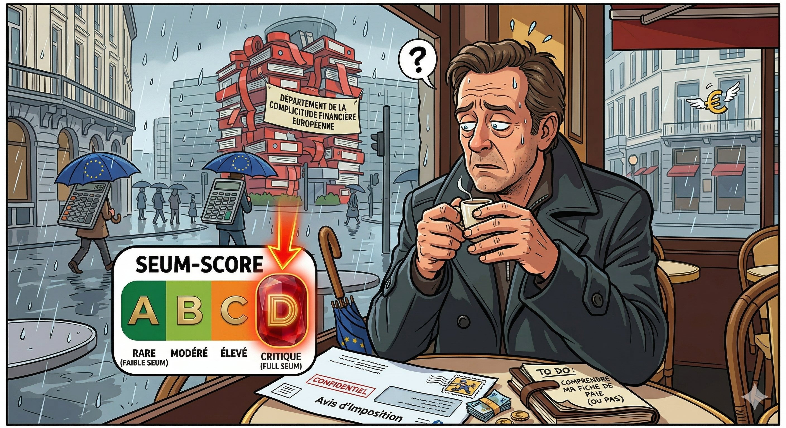{width="80%"}
:::

:::{#cr-inception}
{width="60%"}
:::

:::

:::{.cr-section layout="sidebar-right"}

# Le Moteur : R

**R** est le cœur de l'écosystème. Né dans les années 90, c'est un langage de programmation entièrement dédié aux statistiques, à la science de données et à la visualisation. [@cr-r-logo]

Pourquoi **R** ? [@cr-r-logo]

Il est **open-source**, possède une communauté académique et industrielle immense, et excelle là où d'autres langages doivent utiliser des bibliothèques externes. [@cr-r-logo]

Raconter du code **R** dans un terminal brut peut être parfois très austère. [@cr-r-view]

C'est là qu'intervient **RStudio** (développé par l'entreprise Posit). C'est l'environnement de développement (IDE) incontournable pour tout data scientist. [@cr-r-studio-logo]

Son rôle : Il centralise tout ce dont on a besoin dans une interface intuitive divisée en **4 quadrants distincts**. [@cr-r-studio-ide]

La **console** pour exécuter le code.[@cr-r-studio-ide]{scale-by="1.4" pan-to="30%, -30%"}

L'**éditeur de script** pour écrire le programme. [@cr-r-studio-ide]{scale-by="1.4" pan-to="30%, 30%"}

L'**environnement** pour surveiller les données chargées en mémoire. [@cr-r-studio-ide]{scale-by="1.4" pan-to="-30%, 30%"}

L'**espace de visualisation** pour afficher les graphiques et l'aide. [@cr-r-studio-ide]{scale-by="1.4" pan-to="-30%, -30%"}

En résumé : Si **R** est le **moteur**, **RStudio** est l'**habitacle** confortable de la voiture. [@cr-habitacle]

:::{#cr-r-logo}
{width="200%"}
:::

:::{#cr-r-view}
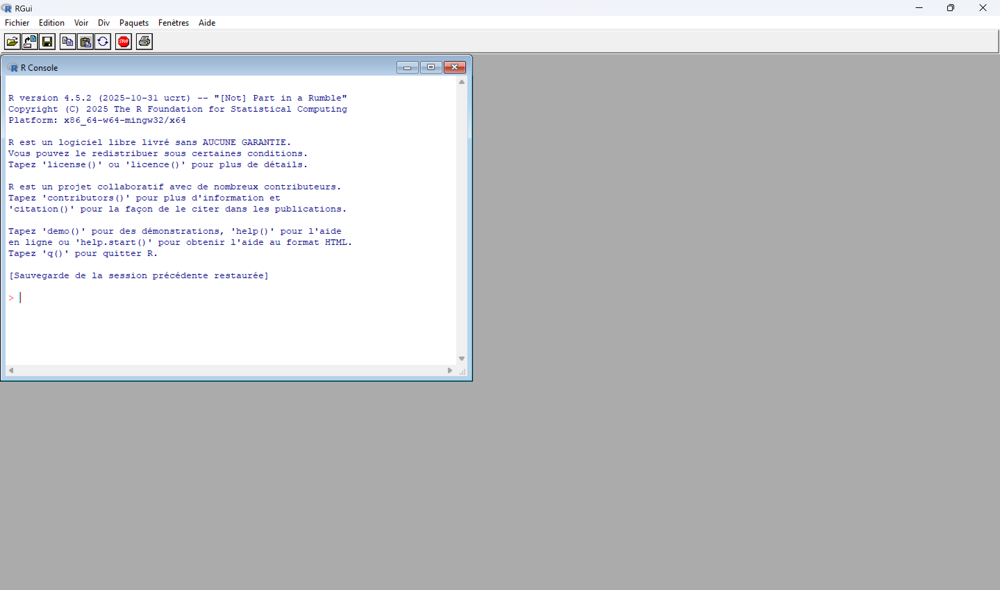{width="100%"}
:::

:::{#cr-r-studio-logo}
{width="200%"}
:::

:::{#cr-r-studio-ide}
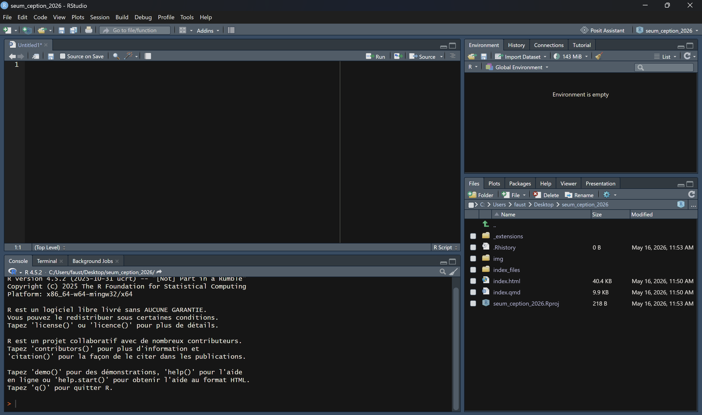{width="100%"}
:::

:::{#cr-habitacle}
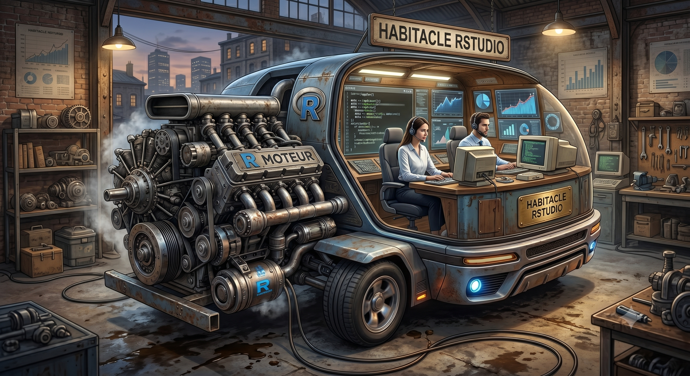{width="100%"}
:::

:::

:::{.cr-section layout="sidebar-left"}

# Le Tidyverse

Pendant longtemps, le R de base avait la réputation d'avoir une syntaxe complexe et parfois incohérente. En 2016, une équipe de développeurs (menée par Hadley Wickham) a standardisé la pratique de R en créant le **Tidyverse**. [@cr-tydiverse]

**Qu'est ce que c'est ?** Une collection de packages conçus pour travailler ensemble et partageant la même philosophie et la même structure de code. [@cr-tydiverse]

La philosophie "Tidy" : les données doivent être propres (chaque variable est une colonne, chaque observation est une ligne). [@cr-tydiverse]

Parmi les piliers, on retrouve **ggplot2**, la référence absolue pour créer des graphiques professionnels et élégants. [@cr-ggplot2]

On utilise également **dplyr** pour manipuler, filtrer et transformer les données avec des mots simples (*filter, select, mutate*). [@cr-dplyr]

Ainsi que **tidyr** pour structurer le tout. [@cr-tidyr]

**L'opérateur Pipe (%>% ou |>) :** C'est la véritable révolution syntaxique. Il permet d'enchaîner les opérations de manière fluide, lisible comme une phrase (ex : Prendre les données $\rightarrow$ Filtrer $\rightarrow$ Calculer la moyenne). [@cr-tydiverse]

L'impact de cette révolution : Le Tidyverse a rendu R beaucoup plus **accessible**, **moderne** et **rapide à apprendre**. Il a transformé R d'un outil purement académique en un standard industriel de la Data Science. [@cr-tydiverse]

:::{#cr-tydiverse}
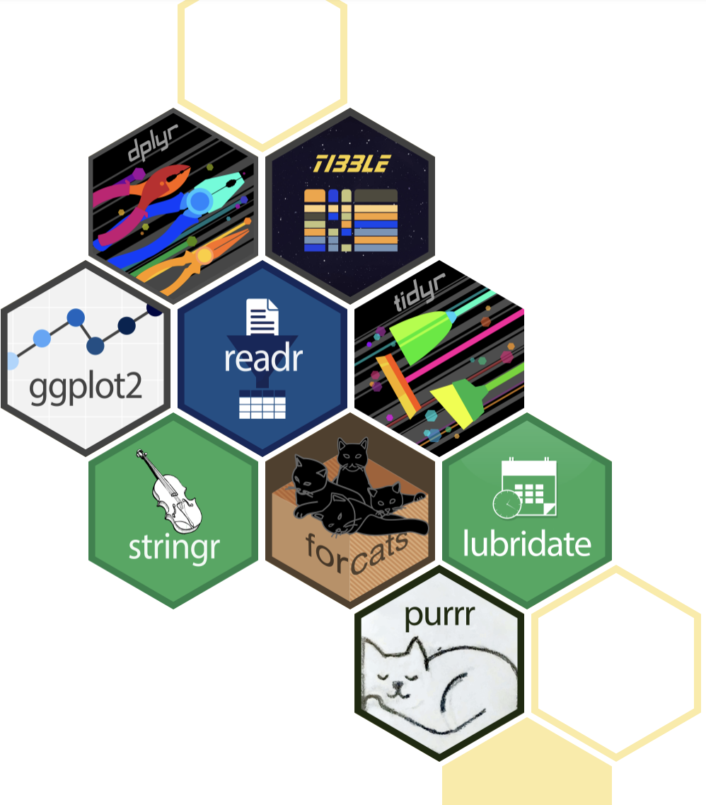{width="70%"}
:::

:::{#cr-ggplot2}
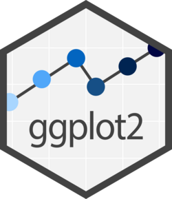
:::

:::{#cr-dplyr}

:::

:::{#cr-tidyr}

:::

:::

:::{.cr-section layout="sidebar-right"}

# La révolution Quarto

Avant, un analyste ouvrait son script R. Il l'exécutait, copiait le graphique obtenu, ouvrait Microsoft Word, collait le graphique, puis rédigeait son texte. [@cr-analyste-content]

Le problème ? Si les données changent le lendemain, il faut tout recommencer à la main. C'est une source d'erreurs chronophage. [@cr-analyste-panique]

C'est là qu'intervient **Quarto** [@cr-quarto]

Mais qu'est-ce que c'est ? C'est un **système de publication scientifique et technique open source**. [@cr-quarto]

Il permet de rédiger en utilisant le format **Markdown**, et de créer du contenu dynamique avec **Python**, **R**, **Julia** et **Observable**. [@cr-quarto]

La véritable puissance de Quarto réside dans sa compilation. À partir d'un seul et même document, vous pouvez : [@cr-quarto]

Publier des **articles** et des rapports de qualité professionnelle. [@cr-article-quarto]

Générer des **diaporamas** pour vos présentations. [@cr-presentation-quarto]

Concevoir des **dashboards** pour piloter vos données. [@cr-dashboard-quarto]

Ou encore créer des **sites web** et des blogs entièrement reproductibles. [@cr-site-web-quarto]

Regardons comment se structure ce fichier "Tout-en-un". Tout en haut, on retrouve l'en-tête **YAML** qui gère les métadonnées et définit le format de sortie. [@cr-code-quarto]{highlight="1-5"}

**Du texte normal** : écrit très simplement en Markdown pour documenter notre analyse sans se soucier du code informatique. [@cr-code-quarto]{highlight="6-11"}

**Des Chunks (Blocs de Code)** : ce sont ces petites fenêtres intégrées au milieu du texte qui contiennent ici nos instructions de filtrage et de visualisation du Tidyverse. [@cr-code-quarto]{highlight="12-26"}

:::{#cr-analyste-content}
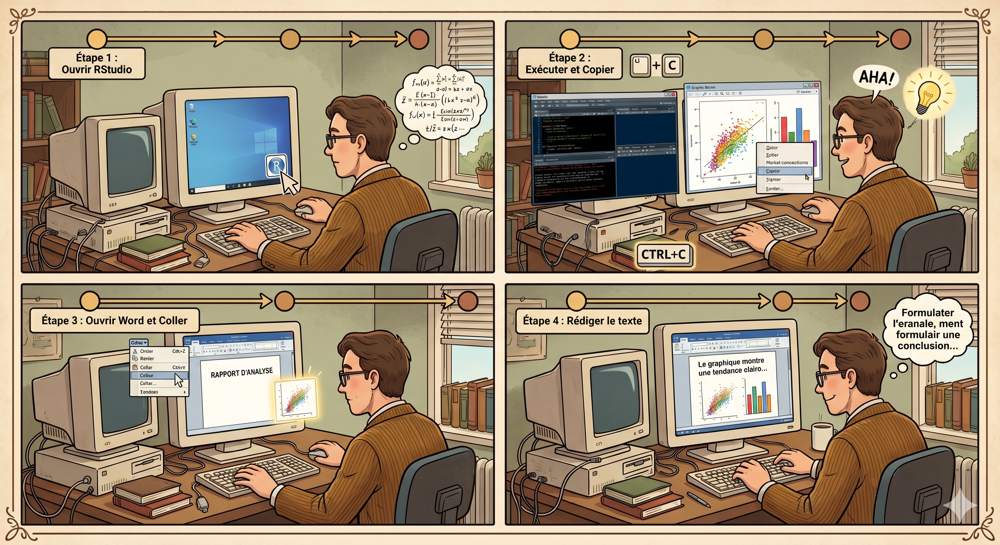{width="80%"}
:::

:::{#cr-analyste-panique}
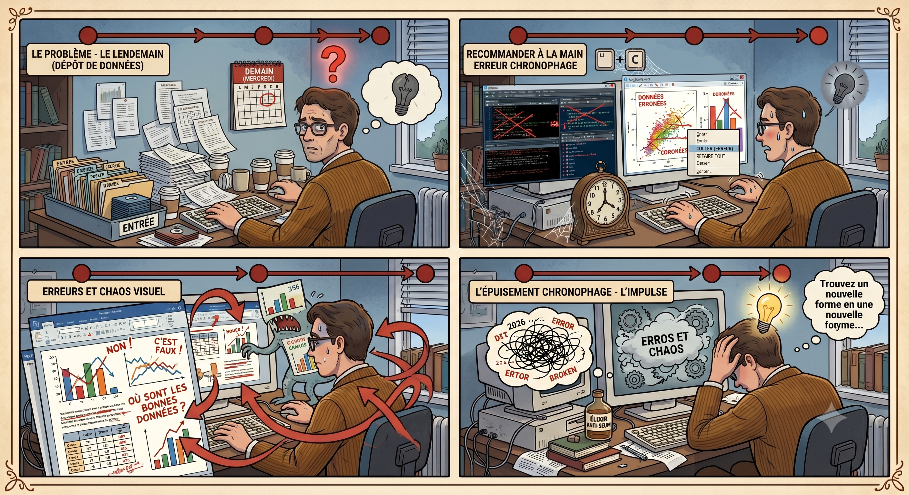{width="80%"}
:::

:::{#cr-quarto}
{width="80%"}
:::

:::{#cr-article-quarto}
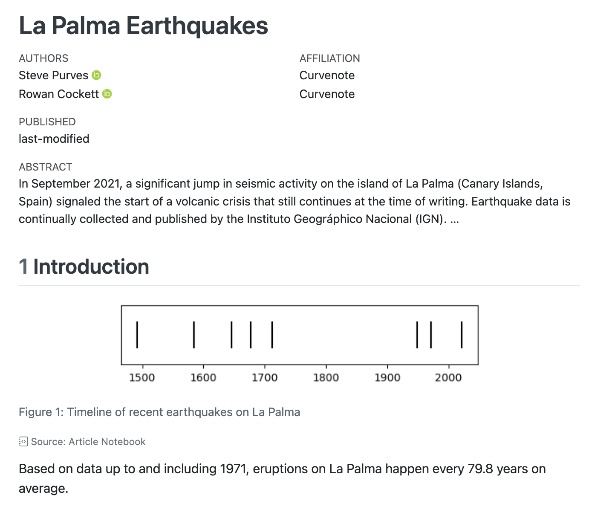{width="80%"}
:::

:::{#cr-presentation-quarto}
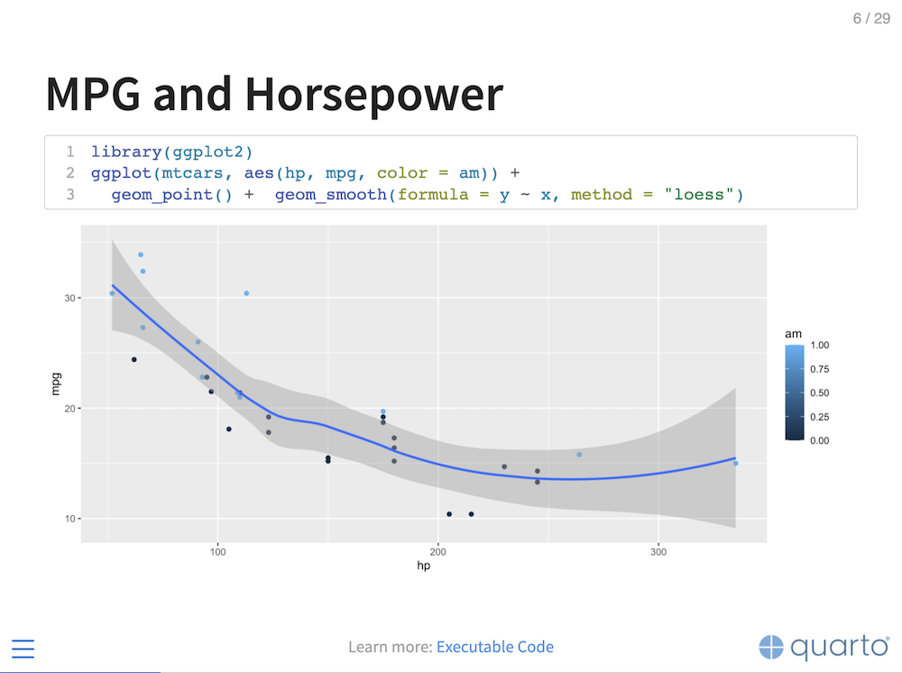{width="80%"}
:::

:::{#cr-dashboard-quarto}
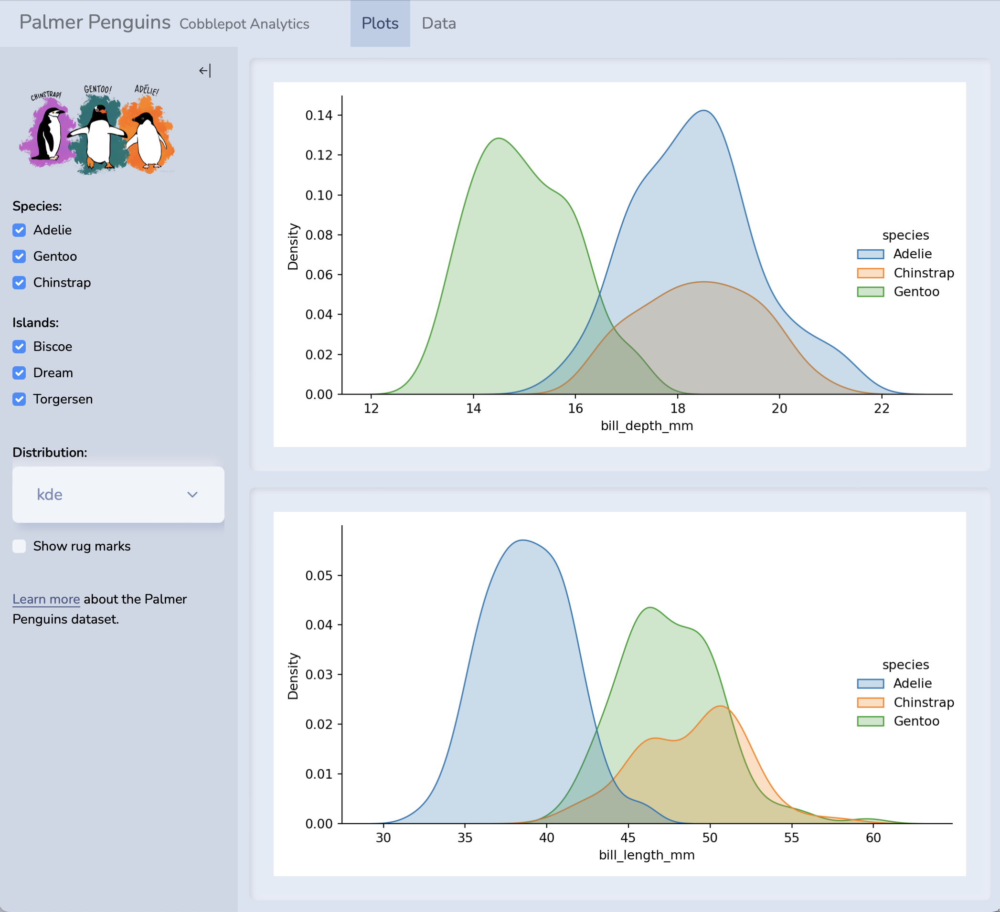{width="80%"}
:::

:::{#cr-site-web-quarto}
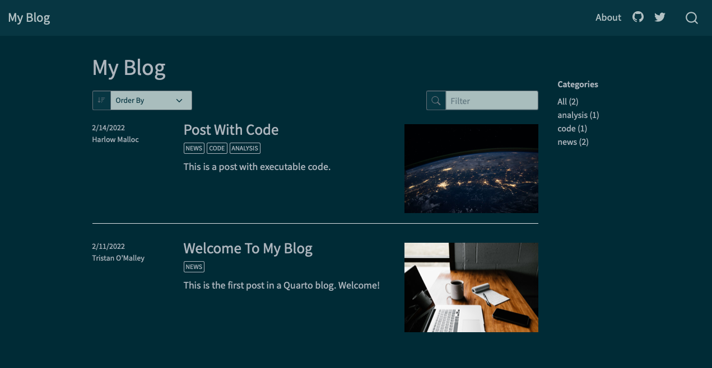{width="80%"}
:::

:::{#cr-code-quarto}
````markdown
---
title: "Mon Premier Document Quarto"
format: html
editor: visual
---

## Introduction

Voici du **texte normal**. Il s'agit d'un paragraphe écrit très simplement 
pour documenter notre analyse. Quarto permet de mettre en forme facilement 
le texte (comme ce mot en **gras**) sans se soucier du code.

## Analyse des données

```{{r}}
#| message: false
#| warning: false
library(tidyverse)

# Un exemple de script R avec le Tidyverse
mpg %>% 
  filter(cyl == 4) %>% 
  ggplot(aes(x = displ, y = hwy)) +
  geom_point(aes(color = class)) +
  labs(title = "Consommation des voitures à 4 cylindres")
```
````
:::

:::

:::{.cr-section layout="sidebar-left"}

# La Magie de Closeread

Quarto permet de créer des pages web statiques, mais **Closeread** leur donne vie grâce au *Scrollytelling*. L'objectif ? Rendre la lecture active en liant le texte et l'image par le mouvement. [@cr-closeread]

Le secret de Closeread repose sur une séparation stricte de l'écran en deux espaces distincts qui cohabitent au sein d'une même section. [@cr-closeread]

À gauche, nous trouvons la **barre narrative**. C'est le texte classique qui défile verticalement au rythme du scroll de l'utilisateur. [@cr-closeread]{scale-by="1.8" pan-to="50%, 0%"}

À droite, nous trouvons la **zone fixe (ou *sticky*)**. C'est le théâtre visuel où les graphiques, les cartes ou les codes restent ancrés à l'écran pendant que le texte passe. [@cr-closeread]{scale-by="1.8" pan-to="-20%, 0%"}

Mais concrètement, comment on code cette séparation ?La première étape se joue dans l'en-tête YAML, en déclarant le format spécifique `closeread-html`. C'est également ici que l'on personnalise l'habillage, que ce soit en choisissant parmi les 25 thèmes Quarto natifs ou en appliquant vos propres réglages (polices, couleurs...).[@cr-demo-syntaxe]{highlight="1-9"}

Une fois le document paramétré, on délimite notre terrain de jeu. Pour cela, on englobe le chapitre concerné dans une balise `:::{.cr-section}`. C'est elle qui active le mode scrollytelling. [@cr-demo-syntaxe]{highlight="11,28"}

Ensuite, il faut préparer l'élément visuel qui restera figé à droite. On l'isole tout en bas de notre code, et on lui donne un identifiant unique précédé d'un dièse, par exemple `#cr-ma-carte`. [@cr-demo-syntaxe]{highlight="24-26"}

Maintenant que les fondations sont posées, comment relier le texte aux visuels ? La véritable magie opère grâce à des **déclencheurs (triggers)** invisibles insérés directement dans le texte à l'aide d'un `@`. [@cr-demo-syntaxe]{highlight="17"}

En ajoutant de simples paramètres entre accolades `{}` derrière ce déclencheur, le texte prend le contrôle direct de la caméra et de l'affichage. [@cr-demo-syntaxe]{highlight="17-22"}

L'attribut `scale-by` permet d'ajuster l'effet de loupe (le zoom global) pour forcer l'œil du lecteur à se focaliser sur une zone précise. [@cr-demo-syntaxe]{highlight="18"}

L'attribut `pan-to` déplace l'élément visuel sur un axe horizontal ou vertical pour recadrer l'attention, créant des transitions fluides. [@cr-demo-syntaxe]{highlight="19"}

Quand l'élément fixe est un bloc de code ou du texte, l'attribut `highlight` entre en scène : il éclaire uniquement les lignes ciblées et estompe tout le reste dans la pénombre. [@cr-demo-syntaxe]{highlight="20"}

Enfin, l'attribut `zoom-to` automatise le travail : il ordonne à la caméra de calculer d'elle-même le meilleur cadrage pour zoomer directement et exclusivement sur les lignes de code sélectionnées. [@cr-demo-syntaxe]{highlight="21"}

La beauté de Quarto, c'est son multilinguisme. Et Closeread le respecte à la lettre ! Vous pouvez mettre en valeur des blocs de code issus de n'importe quel langage. [@cr-multilangues]

**Un peu de style avec CSS** : Vous pouvez afficher comment vous personnalisez l'interface de votre document. Closeread permet d'illuminer les règles CSS de votre choix. [@cr-css-chunk]

**L'incontournable Python** : Vous êtes plutôt de la team Python ? Intégrez du code Pandas ou Matplotlib, et zoomez sur la logique de vos DataFrames. [@cr-python-chunk]

**La puissance de R** : Évidemment, R reste de la partie. Mettez en surbrillance l'enchaînement de vos "pipes" (`%>%` ou `|>`) pour expliquer votre raisonnement étape par étape. [@cr-r-chunk]

**L'interactivité avec OJS** : Et pour le dynamisme côté navigateur, Observable JS (OJS) s'intègre parfaitement. Vous pouvez même surligner les variables réactives qui contrôlent vos graphiques ! [@cr-ojs-chunk]

**Le déploiement en un clic** : Une fois votre document peaufiné, pas besoin de serveurs complexes. Quarto intègre une commande pour propulser votre scrollytelling directement sur GitHub Pages. [@cr-publish-terminal]

:::{#cr-closeread}
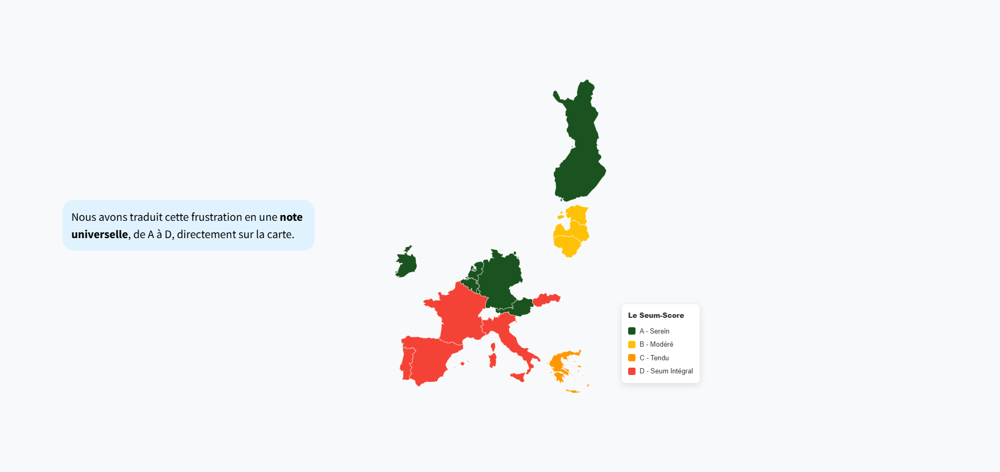{width="100%"}
:::

:::{#cr-demo-syntaxe}
````markdown
---
title: "Seum-score"
author: "Faustin LAFAGE"
format: 
  closeread-html:
    theme: cyborg
    backgroundcolor: darkslateblue
    fontsize: 1.4em
---

:::{.cr-section}

Mon texte narratif défile ici, à gauche...
Je raconte mon histoire au lecteur.

Et soudain, je déclenche l'affichage d'une carte !
[@cr-ma-carte]{
  scale-by="1.5"
  pan-to="20%, -10%"
  highlight="1-5"
  zoom-to="3-8"
}

:::{#cr-ma-carte}

:::

:::
````
:::

:::{#cr-multilangues}
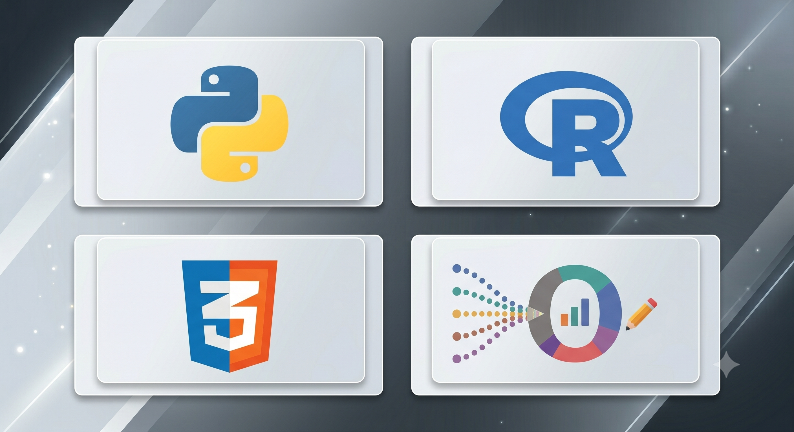{width="80%"}
:::

:::{#cr-css-chunk}
````markdown
```{{=html}}
/* Personnalisation du fond */
.custom-background {
  background-color: #0f172a;
  color: #ffffff;
  padding: 2rem;
}
```
````
:::

:::{#cr-python-chunk}
````markdown
```{{python}}
import pandas as pd

# Filtrer les pays avec un seum critique
df = pd.read_csv("seum_data.csv")
df_filtered = df[df['seum_level'] > 9000]

print(df_filtered.head())
```
````
:::

:::{#cr-r-chunk}
````markdown
```{{r}}
library(dplyr)

donnees_propres <- donnees_brutes %>%
  filter(seum_score > 50) %>%
  mutate(categorie = "Seum élevé")

summary(donnees_propres)
```
````
:::

:::{#cr-ojs-chunk}
````markdown
```{{ojs}}
// Déclaration d'un slider réactif
viewof seuil_seum = Inputs.range([0, 100], {value: 50, step: 1, label: "Seuil de Seum"})

// Filtrage dynamique lié au slider
donnees_filtrees = donnees.filter(d => d.seum > seuil_seum)
```
````
:::

:::{#cr-publish-terminal}

````Markdown
```{{bash}}
# Déployer le projet sur GitHub Pages
quarto publish gh-pages
```
````
:::

:::

:::{.cr-section layout="sidebar-right"}

# Coulisses : le code du seum-score

Comment le **Seum-Score** est-il né ? [@cr-seum-score-2]

L'étincelle est venue d'une expérience professionnelle précédente dans un laboratoire de compléments alimentaires. [@cr-seum-score-2]

J'y ai travaillé sur l'intégration du **Green Impact Index** : un outil développé par les Laboratoires Pierre Fabre pour afficher l'impact environnemental et sociétal des produits. [@cr-g2i]

Et puis, en lisant la description du Hackaviz 2026, une phrase a fait tilt : [@cr-g2i]

> *"L'objectif de ces dépenses étant en premier lieu le bien-être des populations..."* [@cr-g2i]

Mon cerveau a immédiatement fait le lien : et si on appliquait la logique d'un score pour croiser les dépenses réelles des États et le niveau de bonheur ressenti par leurs citoyens ? [@cr-g2i]

Le **Seum-Score** était né ! Une tentative statistique de vérifier si notre argent produit du sourire... ou de la frustration. [@cr-seum-score-2]

Pour concevoir cet index, je m'y suis pris en **4 étapes clés**.

**1) Préparation de l'environnement et importation** : On commence par charger nos packages (`tidyverse`, `FactoMineR`, `sf`, `arrow`) et importer nos fichiers Parquet ainsi que le fond de carte de l'Europe. [@cr-code-import]

**2) Le Nettoyage et la Transformation** : C'est la phase de manipulation des données. On calcule le poids relatif des budgets en % et on opère notre fameuse **inversion sémantique** : multiplier par -1 les variables négatives (solitude, chômage) pour aligner les graphiques. [@cr-code-clean]

**3) La Reconduction (Fusion et Imputation)** : On interconnecte nos sources de données par pays. Pour gérer proprement les données manquantes sans supprimer de lignes, on utilise un algorithme d'imputation mathématique via le package `missMDA`. [@cr-code-reconduction]

**4) L'Analyse statistique et les Exports** : Le bouquet final : on exécute l'ACP et la CAH pour isoler nos 4 profils de Seum. Enfin, on exporte les matrices en `.csv` et le fichier spatial `seum.geojson` pour nourrir nos graphiques interactifs en Observable JS. [@cr-code-analyse]

**5) La Visualisation Interactive (Observable JS)** : C'est la brique magique qui s'exécute directement dans le navigateur du lecteur. Observable JS récupère nos fichiers légers et dessine en temps réel la carte et les graphiques vectoriels interactifs au pixel près. [@cr-code-ojs]

:::{#cr-seum-score-2}
{width="80%"}
:::

:::{#cr-g2i}
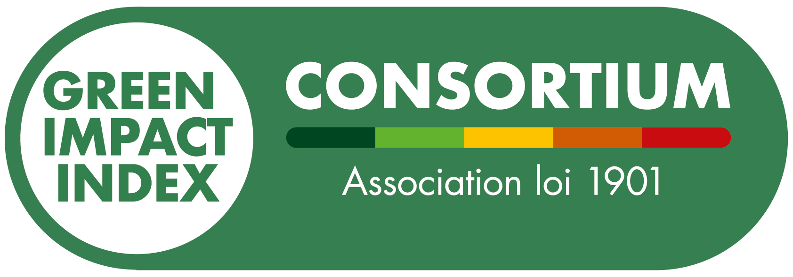{width="100%"}
:::

:::{#cr-code-import}
````markdown
library(arrow)      
library(tidyverse)  
library(FactoMineR) 
library(factoextra) 
library(sf)         
library(missMDA)

# Chemins
path <- "data/"

# Imports
bien_etre <- read_parquet(file.path(path, "parquet_long", "bien_etre.parquet"))
depenses  <- read_parquet(file.path(path, "parquet_long", "depenses_euro.parquet"))
geo <- st_read(file.path(path, "geojson", "carte.geojson"), quiet = TRUE)
````
:::

:::{#cr-code-clean}
````markdown
# Calcul des parts budgétaires de l'État
df_depenses <- depenses %>% 
  filter(Cde_Dépense %in% c("GF01", "GF02", "GF03"), Année == "2022") %>%
  group_by(Pays) %>%
  mutate(Part_Budget = (Montant / sum(Montant, na.rm = TRUE)) * 100)

# L'inversion sémantique magique
df_bien_etre <- bien_etre %>% 
  mutate(Valeur_Mesurée = if_else(
    Mesure %in% mesures_negatives, Valeur_Mesurée * -1, Valeur_Mesurée
  ))
````
:::

:::{#cr-code-reconduction}
````markdown
# Fusion sémantique des tables
data_brute <- inner_join(df_depenses, df_bien_etre, by = c("Pays", "Année"))

# Traitement automatique des valeurs manquantes (missMDA)
data_filtree <- data_brute %>% select(where(~ mean(is.na(.)) < 0.5))
res_impute <- imputePCA(data_filtree, ncp = 2)
data_complete <- res_impute$completeObs
````
:::

:::{#cr-code-analyse}
````markdown
# Moteur statistique (ACP + CAH Clustering)
res_pca <- PCA(data_complete, scale.unit = TRUE, graph = FALSE)
res_hcpc <- HCPC(res_pca, nb.clust = 4, graph = FALSE)

# Exports plats pour l'interactivité Observable JS
write_csv(corr_data, "corr_data.csv")
write_csv(pca_inds, "pca_inds.csv")
sf::st_write(geo_final, "seum.geojson", delete_dsn = TRUE, quiet = TRUE)
````
:::

:::{#cr-code-ojs}
````markdown
// Lecture du fichier généré par R et tracé du graphique
data_corr = FileAttachment("corr_data.csv").csv({typed: true})

Plot.plot({
  color: { type: "diverging", scheme: "RdBu", domain: [-1, 1] },
  marks: [
    Plot.cell(data_corr, { x: "var1", y: "var2", fill: "correlation" })
  ]
})
````
:::

:::

:::{.cr-section layout="sidebar-left"}

# Retour d'expérience

Avant de refermer ce chapitre, faisons une petite pause hors de la matrice technique. Qui se cache derrière ce projet ? [@cr-purpan]

À la base, je suis **Ingénieur Agronome**, diplômé de l'école d'ingénieurs de Purpan à Toulouse. L'informatique, le développement et la data n'étaient absolument pas mon corps de métier. Mon terrain, c'était le vivant ! [@cr-terrain]

Mais la data a un pouvoir d'attraction puissant. J'ai commencé à coder en R de manière totalement autodidacte pendant mes stages d'études, poussé par une immense curiosité pour le domaine. [@cr-acp]

Mon secret pour combler mon manque de bagage en informatique ? **L'Intelligence Artificielle**. J'ai utilisé l'IA comme un mentor quotidien pour comprendre mes erreurs, apprendre la logique algorithmique et débloquer mes scripts. L'IA n'a pas remplacé mon apprentissage, elle l'a décuplé. [@cr-learning]

Pour réaliser la dataviz du **Seum-Score**, de l'idée initiale jusqu'à la publication web, j'estime la charge de travail à **environ 30 heures**. [@cr-win]

Trente heures d'exploration intense, car pour être totalement transparent : **je ne connaissais absolument pas la syntaxe de Closeread avant de démarrer cette viz.** [@cr-win]

C'est la preuve ultime que cet écosystème est accessible. Avec une formation différente, beaucoup d'envie et les bons outils, il est tout à fait possible de sortir des graphiques classiques pour créer des expériences immersives et professionnelles. [@cr-win]

:::{#cr-purpan}

:::

:::{#cr-terrain}

:::

:::{#cr-acp}
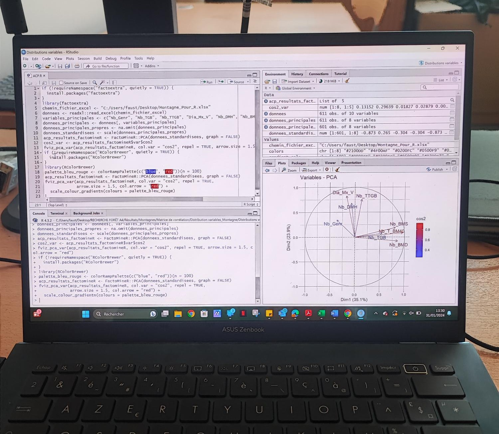{width="80%"}
:::

:::{#cr-learning}

:::

:::{#cr-win}
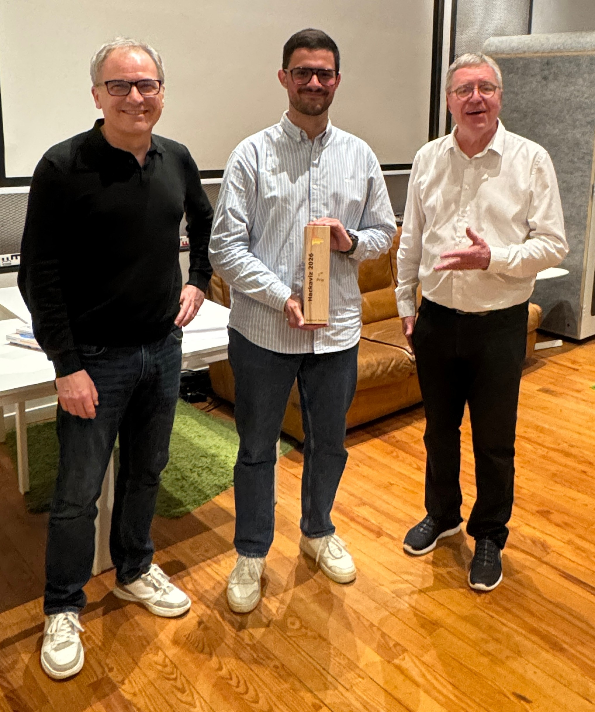{width=50%}
:::

:::

:::{.cr-section layout="sidebar-right"}

# Conclusion : Sortir de la matrice

Voilà comment s'achève notre infiltration au cœur du **Seum-Score**. [@cr-seum-score]

En combinant la puissance brute de **R**, la rigueur du **Tidyverse**, la polyvalence de **Quarto**, le dynamisme de **Closeread** et l'interactivité d'**Observable JS**, nous avons fait bien plus que de la simple technique. [@cr-seum-score]

Le projet est entièrement reproductible, open-source et prêt à être décliné pour d'autres analyses. À vous maintenant de vous emparer de cette stack pour donner vie à vos propres données ! [@cr-seum-score]

Merci à tous pour votre attention. La matrice est désormais ouverte à vos questions ! [@cr-seum-score]

:::{#cr-seum-score}
{width="80%"}
:::

:::

\
\
\

---

# 📚 Reconstruire la matrice chez vous (Liens & Installation)

Si vous voulez cloner ce projet ou créer votre propre scrollytelling, voici le guide de démarrage rapide :

| Outil / Ressource | Ce qu'il faut installer / Consulter | Lien Officiel |
| :--- | :--- | :--- |
| **Le Cœur (R)** | Télécharger l'environnement de calcul R complet. | [CRAN Project](https://cloud.r-project.org/) |
| **L'Habitacle (RStudio)** | Installer l'IDE RStudio Desktop (édité par Posit). | [Posit Download](https://posit.co/download/rstudio-desktop/) |
| **Le Châssis (Quarto)** | Installer le Quarto CLI (le moteur de compilation). | [Quarto Get Started](https://quarto.org/) |
| **La Caméra (Closeread)** | L'extension de Scrollytelling officielle pour Quarto. | [Closeread Guide](https://closeread.dev/) |
| **Le Dessin (OJS Plot)** | La documentation pour coder les graphiques réactifs. | [Observable Plot](https://observablehq.com/plot/) |

> **Pour installer Closeread dans votre projet :** Ouvrez votre terminal à la racine de votre dossier de travail Quarto et exécutez simplement la commande suivante :
>
> quarto add qmd-lab/closeread
>

*Dataviz créée par [Faustin LAFAGE](https://www.linkedin.com/in/faustin-lafage/?skipRedirect=true).